# Lenovo Homelab Infrastructure Diagram

> [!NOTE]
> This diagram represents the complete infrastructure as of January 2026, including all services, network topology, monitoring, and backup systems.

## Infrastructure Overview

```mermaid
graph TB
    subgraph Internet["🌐 Internet"]
        CF_DNS["Cloudflare DNS<br/>gmojsoski.com"]
        CF_TUNNEL_CLOUD["Cloudflare Tunnel Service<br/>Edge Network"]
        BACKBLAZE["Backblaze B2<br/>Bucket: Goce-Lenovo<br/>☁️ Offsite Backup"]
    end

    subgraph HomeNetwork["🏠 Home Network - 192.168.1.x"]
        ROUTER["Router<br/>DHCP DNS → Pi-hole"]
        
        subgraph RaspberryPi["🥧 Raspberry Pi 4 (pihole)<br/>4GB RAM | ARM64 | Gigabit Ethernet"]
            subgraph PiServices["Docker Services (host network)"]
                PIHOLE["Pi-hole<br/>:53 DNS<br/>:80 Web UI<br/>Network-wide Ad Blocking"]
                UNBOUND["Unbound<br/>:5335<br/>Recursive DNS Resolver<br/>Queries Root Servers"]
                PI_ALERT["Pi Alert<br/>Network Monitoring<br/>Device Discovery<br/>→ Mattermost Alerts"]
                UPTIME_KUMA_PI["Uptime Kuma<br/>:3001<br/>Secondary Instance"]
            end
        end
        
        subgraph ThinkCentre["💻 Lenovo ThinkCentre (lemongrab)<br/>Intel Pentium G4560T @ 2.90GHz | 2C/4T | 32GB DDR4 | 512GB NVMe SSD"]
            subgraph Storage["💾 Storage Layout"]
                ROOT["/root - 102GB"]
                HOME["/home - 374GB<br/>Docker Data Location"]
                MNT_SSD["/mnt/ssd<br/>Symlinks + Backups"]
            end
            
            subgraph CoreInfra["🔧 Core Infrastructure"]
                CADDY["Caddy Reverse Proxy<br/>:8080 HTTP | :8443 HTTPS<br/>Split Config Architecture<br/>mem: unlimited"]
                CLOUDFLARED_1["Cloudflared Replica 1<br/>host network<br/>Tunnel: portfolio"]
                CLOUDFLARED_2["Cloudflared Replica 2<br/>host network<br/>High Availability"]
                WATCHTOWER["Watchtower<br/>Auto-updates @ 2 AM<br/>Excludes: Nextcloud,<br/>Vaultwarden, Jellyfin,<br/>KitchenOwl"]
            end
            
            subgraph MediaServices["📺 Media Services (profile: media)"]
                JELLYFIN["Jellyfin<br/>:8096<br/>jellyfin.gmojsoski.com<br/>Movies, TV, Music, Books<br/>mem: 8GB | cpu: 2.0"]
            end
            
            subgraph StorageServices["☁️ Storage Services"]
                NEXTCLOUD_APP["Nextcloud App<br/>:8081<br/>cloud.gmojsoski.com<br/>Apache + PostgreSQL<br/>mem: 4GB | cpu: 1.0"]
                NEXTCLOUD_DB["PostgreSQL 16<br/>:5432<br/>nextcloud DB<br/>mem: 2GB | cpu: 1.0<br/>Health Check: pg_isready"]
                VAULTWARDEN["Vaultwarden<br/>:8082<br/>vault.gmojsoski.com<br/>Password Manager<br/>CRITICAL backups"]
                NGINX_VW["Nginx Proxy<br/>:8083<br/>DELETE→PUT rewrite<br/>iOS Compatibility Fix"]
            end
            
            subgraph ProductivityServices["📝 Productivity (profile: productivity)"]
                PAPERLESS_WEB["Paperless-ngx<br/>:8097<br/>paperless.gmojsoski.com<br/>Document Management<br/>mem: 2GB | cpu: 1.0"]
                PAPERLESS_REDIS["Redis 8<br/>:6379<br/>Paperless Broker<br/>mem: 512MB | cpu: 0.5"]
                MATTERMOST_APP["Mattermost Team<br/>:8066<br/>mattermost.gmojsoski.com<br/>Slack Alternative<br/>mem: 4GB | cpu: 1.0"]
                MATTERMOST_DB["PostgreSQL 15<br/>:5432<br/>mattermost DB<br/>mem: 2GB | cpu: 1.0<br/>Health Check: pg_isready"]
                OUTLINE_APP["Outline<br/>:8098<br/>Local Only<br/>Wiki & Knowledge Base"]
                OUTLINE_DB["PostgreSQL<br/>Outline Database"]
                OUTLINE_REDIS["Redis<br/>Outline Cache"]
            end
            
            subgraph UtilityServices["🛠️ Utilities (profile: utilities)"]
                KITCHENOWL["KitchenOwl<br/>:8092<br/>shopping.gmojsoski.com<br/>27 Recipes<br/>Shopping Lists"]
                GOKAPI["Gokapi<br/>:8091<br/>files.gmojsoski.com<br/>File Sharing"]
                TRAVELSYNC["TravelSync<br/>:8000<br/>tickets.gmojsoski.com<br/>Travel Documents"]
                GOATCOUNTER["GoatCounter<br/>:8088<br/>analytics.gmojsoski.com<br/>Web Analytics"]
                LINKWARDEN["Linkwarden<br/>:8090<br/>linkwarden.gmojsoski.com<br/>Bookmarks + Archiving"]
                UPTIME_KUMA["Uptime Kuma<br/>:3001<br/>Monitoring & Alerts<br/>60s intervals"]
                PORTAINER["Portainer<br/>:9000<br/>Docker Management UI"]
                HOMEPAGE["Homepage<br/>:3002<br/>Service Dashboard"]
            end
            
            subgraph SystemdServices["⚙️ Systemd Services"]
                PLANNING_POKER["Planning Poker<br/>:3000<br/>poker.gmojsoski.com<br/>Node.js App"]
                BOOKMARKS["Flask Bookmarks<br/>:5000<br/>bookmarks.gmojsoski.com<br/>Python App"]
            end
            
            subgraph MonitoringAutomation["🛡️ Monitoring & Automation"]
                HEALTH_CHECK["Enhanced Health Check<br/>Timer: Every 3 minutes<br/>Script: /usr/local/bin/<br/>enhanced-health-check.sh"]
                BACKUP_VERIFY["Backup Verification<br/>Hourly via Health Check<br/>verify-backups.sh"]
                ANALYTICS_REPORT["Analytics Bot<br/>Weekly Report<br/>Sunday @ 10 AM<br/>→ Mattermost"]
                PI_MONITORING["System Bot<br/>Health Reports<br/>Every 5 days<br/>→ Mattermost"]
            end
            
            subgraph BackupSystem["💾 Backup System"]
                LOCAL_BACKUPS["/mnt/ssd/backups/<br/>vaultwarden/ (48h max)<br/>nextcloud/ (48h max)<br/>kitchenowl/ (72h max)<br/>travelsync/ (72h max)<br/>linkwarden/ (96h max)"]
                BACKUP_SCRIPTS["Backup Scripts<br/>Daily @ 2:00 AM<br/>backup-all-critical.sh<br/>Multi-tier Retention:<br/>6 hourly, 5 daily,<br/>4 weekly, 2 monthly,<br/>1 yearly"]
                B2_SYNC["rclone Sync<br/>Daily @ 3:00 AM<br/>sync-backups-to-b2.sh<br/>→ Backblaze B2"]
            end
        end
    end

    %% Internet Connections
    CF_DNS -->|DNS Resolution| CF_TUNNEL_CLOUD
    CF_TUNNEL_CLOUD -->|Encrypted Tunnel| CLOUDFLARED_1
    CF_TUNNEL_CLOUD -->|Encrypted Tunnel| CLOUDFLARED_2
    
    %% Router & DNS Flow
    ROUTER -->|DNS Queries| PIHOLE
    PIHOLE -->|Upstream DNS<br/>127.0.0.1:5335| UNBOUND
    UNBOUND -->|Root DNS Queries| Internet
    
    %% Pi-hole Monitoring
    PI_ALERT -->|Network Alerts| MATTERMOST_APP
    
    %% Cloudflare Tunnel to Caddy
    CLOUDFLARED_1 -->|localhost:8080| CADDY
    CLOUDFLARED_2 -->|localhost:8080| CADDY
    
    %% Caddy Routing (organized by config files)
    CADDY -->|10-portfolio.caddyfile<br/>gmojsoski.com| HOMEPAGE
    CADDY -->|20-media.caddyfile<br/>jellyfin.gmojsoski.com| JELLYFIN
    CADDY -->|20-media.caddyfile<br/>paperless.gmojsoski.com| PAPERLESS_WEB
    CADDY -->|20-media.caddyfile<br/>vault.gmojsoski.com| NGINX_VW
    CADDY -->|30-storage.caddyfile<br/>cloud.gmojsoski.com| NEXTCLOUD_APP
    CADDY -->|30-storage.caddyfile<br/>tickets.gmojsoski.com| TRAVELSYNC
    CADDY -->|30-storage.caddyfile<br/>files.gmojsoski.com| GOKAPI
    CADDY -->|40-communication.caddyfile<br/>mattermost.gmojsoski.com| MATTERMOST_APP
    CADDY -->|40-communication.caddyfile<br/>poker.gmojsoski.com| PLANNING_POKER
    CADDY -->|50-utilities.caddyfile<br/>analytics.gmojsoski.com| GOATCOUNTER
    CADDY -->|50-utilities.caddyfile<br/>bookmarks.gmojsoski.com| BOOKMARKS
    CADDY -->|50-utilities.caddyfile<br/>shopping.gmojsoski.com| KITCHENOWL
    CADDY -->|50-utilities.caddyfile<br/>linkwarden.gmojsoski.com| LINKWARDEN
    
    %% Nginx to Vaultwarden
    NGINX_VW -->|:8082<br/>Method Rewrite| VAULTWARDEN
    
    %% Database Dependencies
    NEXTCLOUD_DB -->|service_healthy| NEXTCLOUD_APP
    MATTERMOST_DB -->|service_healthy| MATTERMOST_APP
    PAPERLESS_REDIS -->|service_started| PAPERLESS_WEB
    OUTLINE_DB -->|service_healthy| OUTLINE_APP
    OUTLINE_REDIS -->|service_healthy| OUTLINE_APP
    
    %% Shared Database (Paperless uses Nextcloud's PostgreSQL)
    NEXTCLOUD_DB -.->|paperless DB| PAPERLESS_WEB
    
    %% Storage Paths
    HOME -->|/home/docker-projects/| CoreInfra
    HOME -->|/home/docker-projects/| MediaServices
    HOME -->|/home/docker-projects/| UtilityServices
    HOME -->|/home/docker-projects/| ProductivityServices
    MNT_SSD -->|symlink| HOME
    MNT_SSD -->|/mnt/ssd/backups/| LOCAL_BACKUPS
    
    %% Backup Flows
    VAULTWARDEN -.->|Daily Backup| BACKUP_SCRIPTS
    NEXTCLOUD_APP -.->|Daily Backup| BACKUP_SCRIPTS
    KITCHENOWL -.->|Daily Backup| BACKUP_SCRIPTS
    TRAVELSYNC -.->|Daily Backup| BACKUP_SCRIPTS
    LINKWARDEN -.->|Daily Backup| BACKUP_SCRIPTS
    BACKUP_SCRIPTS -->|tar.gz archives| LOCAL_BACKUPS
    LOCAL_BACKUPS -->|rclone sync| B2_SYNC
    B2_SYNC -->|443 files synced| BACKBLAZE
    
    %% Monitoring Flows
    HEALTH_CHECK -->|Every 3 min<br/>Check Services| CoreInfra
    HEALTH_CHECK -->|Check Services| MediaServices
    HEALTH_CHECK -->|Check Services| StorageServices
    HEALTH_CHECK -->|Check Services| ProductivityServices
    HEALTH_CHECK -->|Check Services| UtilityServices
    HEALTH_CHECK -->|Cloudflare Config<br/>Validation| CLOUDFLARED_1
    HEALTH_CHECK -->|Caddyfile<br/>Validation| CADDY
    HEALTH_CHECK -->|Resource Monitoring<br/>Memory ≥85% warn<br/>Disk ≥80% warn| ThinkCentre
    HEALTH_CHECK -->|Alerts @here/@all| MATTERMOST_APP
    BACKUP_VERIFY -->|Hourly Integrity<br/>Checks| LOCAL_BACKUPS
    BACKUP_VERIFY -->|Backup Alerts @all| MATTERMOST_APP
    ANALYTICS_REPORT -->|Weekly Stats| MATTERMOST_APP
    PI_MONITORING -->|System Health<br/>Every 5 days| MATTERMOST_APP
    
    %% Uptime Kuma Monitoring
    UPTIME_KUMA -->|Monitor All<br/>Services| CADDY
    UPTIME_KUMA -->|External Checks| CF_TUNNEL_CLOUD
    UPTIME_KUMA_PI -->|Secondary<br/>Monitoring| PIHOLE
    
    %% Watchtower Updates
    WATCHTOWER -.->|Auto-update<br/>Daily @ 2 AM| CoreInfra
    WATCHTOWER -.->|Auto-update| UtilityServices
    WATCHTOWER -.->|Auto-update| ProductivityServices
    WATCHTOWER -.->|EXCLUDED| NEXTCLOUD_APP
    WATCHTOWER -.->|EXCLUDED| VAULTWARDEN
    WATCHTOWER -.->|EXCLUDED| JELLYFIN
    WATCHTOWER -.->|EXCLUDED| KITCHENOWL
    
    %% Portainer Management
    PORTAINER -.->|Docker Socket<br/>Management| CoreInfra
    PORTAINER -.->|Manage| MediaServices
    PORTAINER -.->|Manage| StorageServices
    PORTAINER -.->|Manage| ProductivityServices
    PORTAINER -.->|Manage| UtilityServices

    %% Styling
    classDef internet fill:#e1f5ff,stroke:#01579b,stroke-width:2px
    classDef hardware fill:#fff3e0,stroke:#e65100,stroke-width:3px
    classDef core fill:#f3e5f5,stroke:#4a148c,stroke-width:2px
    classDef media fill:#e8f5e9,stroke:#1b5e20,stroke-width:2px
    classDef storage fill:#fff9c4,stroke:#f57f17,stroke-width:2px
    classDef productivity fill:#fce4ec,stroke:#880e4f,stroke-width:2px
    classDef utility fill:#e0f2f1,stroke:#004d40,stroke-width:2px
    classDef monitoring fill:#ffebee,stroke:#b71c1c,stroke-width:2px
    classDef backup fill:#f1f8e9,stroke:#33691e,stroke-width:2px
    classDef database fill:#e3f2fd,stroke:#0d47a1,stroke-width:2px
    
    class CF_DNS,CF_TUNNEL_CLOUD,BACKBLAZE internet
    class ThinkCentre,RaspberryPi hardware
    class CADDY,CLOUDFLARED_1,CLOUDFLARED_2,WATCHTOWER core
    class JELLYFIN media
    class NEXTCLOUD_APP,VAULTWARDEN,NGINX_VW,GOKAPI,TRAVELSYNC storage
    class PAPERLESS_WEB,MATTERMOST_APP,OUTLINE_APP productivity
    class KITCHENOWL,GOATCOUNTER,LINKWARDEN,UPTIME_KUMA,PORTAINER,HOMEPAGE,PLANNING_POKER,BOOKMARKS utility
    class HEALTH_CHECK,BACKUP_VERIFY,ANALYTICS_REPORT,PI_MONITORING,UPTIME_KUMA_PI,PIHOLE,UNBOUND,PI_ALERT monitoring
    class LOCAL_BACKUPS,BACKUP_SCRIPTS,B2_SYNC backup
    class NEXTCLOUD_DB,MATTERMOST_DB,PAPERLESS_REDIS,OUTLINE_DB,OUTLINE_REDIS database
```

## Key Infrastructure Details

### Hardware Specifications

| Device | CPU | RAM | Storage | Network | Role |
|--------|-----|-----|---------|---------|------|
| **ThinkCentre (lemongrab)** | Intel Pentium G4560T @ 2.90GHz (2C/4T) | 32GB DDR4 | 512GB NVMe SSD | Gigabit Ethernet | Main application server |
| **Raspberry Pi 4 (pihole)** | ARM64 | 4GB | SD Card | Gigabit Ethernet + WiFi | DNS & ad blocking |

### Network Architecture

- **External Access**: Cloudflare Tunnel (2 replicas for HA) → Caddy reverse proxy
- **DNS Flow**: Router DHCP → Pi-hole (:53) → Unbound (:5335) → Root DNS servers
- **Domain**: gmojsoski.com (all subdomains routed through Cloudflare)
- **Internal Routing**: Caddy split config architecture (5 category files)

### Service Organization

**Docker Profiles**:
- **Critical** (no profile): Caddy, Cloudflared, Vaultwarden, Nextcloud - always running
- **media**: Jellyfin
- **productivity**: Paperless, Mattermost, Outline
- **utilities**: Uptime Kuma, GoatCounter, Portainer
- **databases**: Auto-started with dependent services
- **all**: Convenience profile for all services

### Resource Limits

| Service | Memory Limit | CPU Limit | Notes |
|---------|--------------|-----------|-------|
| Jellyfin | 8GB | 2.0 CPUs | Highest resources for media transcoding |
| Nextcloud App | 4GB | 1.0 CPU | Cloud storage |
| Mattermost App | 4GB | 1.0 CPU | Team communication |
| Paperless | 2GB | 1.0 CPU | Document processing |
| Nextcloud DB | 2GB | 1.0 CPU | PostgreSQL 16 |
| Mattermost DB | 2GB | 1.0 CPU | PostgreSQL 15 |
| Paperless Redis | 512MB | 0.5 CPU | Message broker |

### Monitoring & Recovery

**Multi-layer System**:
1. **Enhanced Health Check** (every 3 min): Service checks, auto-restart, config validation
2. **Docker Restart Policies**: Auto-restart on failure
3. **Cloudflare Tunnel**: 2 replicas for redundancy
4. **Uptime Kuma**: External monitoring (60s intervals) + secondary Pi instance
5. **System Reports**: Every 5 days to Mattermost
6. **Analytics Reports**: Weekly (Sunday 10 AM) to Mattermost

**Health Check Features**:
- Cloudflare Tunnel config validation (127.0.0.1 → localhost auto-fix)
- Caddyfile validation (main + all split configs)
- Resource monitoring (Memory ≥85% warn, Disk ≥80% warn)
- Backup verification (hourly integrity checks)
- Mattermost notifications (@here for warnings, @all for critical)

### Backup Strategy

**Multi-tier Retention**:
- **Hourly**: Last 6 backups
- **Daily**: Last 5 backups
- **Weekly**: Last 4 backups
- **Monthly**: Last 2 backups
- **Yearly**: Last 1 backup

**Total**: ~18 backups per service

**Service Priority**:
- **CRITICAL** (48h max age): Vaultwarden, Nextcloud
- **IMPORTANT** (72h max age): TravelSync, KitchenOwl
- **MEDIUM** (96h max age): Linkwarden

**Offsite Backup**:
- **Provider**: Backblaze B2
- **Bucket**: Goce-Lenovo
- **Schedule**: Daily @ 3:00 AM (after local backups)
- **Status**: 443 files synced
- **Tool**: rclone

### Security & Configuration

**Caddy Split Config**:
- `10-portfolio.caddyfile` - Portfolio site
- `20-media.caddyfile` - Media services (Jellyfin, Paperless, Vaultwarden)
- `30-storage.caddyfile` - Storage (Nextcloud, TravelSync, Gokapi)
- `40-communication.caddyfile` - Communication (Mattermost, Planning Poker)
- `50-utilities.caddyfile` - Utilities (Analytics, Bookmarks, Shopping, Linkwarden)

**Benefits**: Service config errors are isolated, preventing cascading failures

**Vaultwarden iOS Fix**: Nginx proxy rewrites DELETE → PUT for iOS compatibility

**Database Sharing**: Paperless uses Nextcloud's PostgreSQL instance (separate database)

### Automation

**Systemd Timers**:
- `enhanced-health-check.timer`: Every 3 minutes
- `slack-goatcounter-weekly.timer`: Sunday @ 10 AM
- `slack-pi-monitoring.timer`: Every 5 days
- `portfolio-update.timer`: Manual trigger via `make portfolio-update`

**Watchtower**:
- Schedule: Daily @ 2:00 AM
- Excludes: Nextcloud, Vaultwarden, Jellyfin, KitchenOwl (manual updates only)

## Expansion Considerations

> [!TIP]
> **For Future Expansion**:
> - **Hardware**: ThinkCentre has 2C/4T CPU - consider CPU upgrade for more concurrent services
> - **Storage**: 512GB SSD with 374GB /home partition - monitor disk usage as media library grows
> - **Memory**: 32GB RAM is generous - current services use ~50-60% under load
> - **Network**: Single Gigabit Ethernet - consider link aggregation or 2.5GbE upgrade for media streaming
> - **Raspberry Pi**: 4GB RAM is sufficient for Pi-hole + Unbound + Pi Alert
> - **Services**: Docker profiles allow selective startup - useful for resource management
> - **Backup**: Backblaze B2 costs scale with storage - monitor monthly costs as backup size grows
> - **Monitoring**: Consider adding Prometheus + Grafana for detailed metrics visualization
> - **Database**: Shared PostgreSQL instance (Nextcloud + Paperless) - monitor connection limits
> - **Redundancy**: Consider second ThinkCentre for service failover or load balancing

> [!IMPORTANT]
> **Critical Dependencies**:
> - Cloudflare Tunnel requires stable internet connection (2 replicas provide redundancy)
> - Pi-hole is single point of failure for DNS - consider Pi-hole HA setup or fallback DNS
> - Caddy is single reverse proxy - all services depend on it
> - PostgreSQL databases have health checks - dependent services wait for healthy state
> - Backup verification runs hourly - alerts sent to Mattermost for failures

> [!WARNING]
> **Resource Constraints**:
> - CPU: 2C/4T may bottleneck with all services running + media transcoding
> - Disk: /home partition (374GB) holds all Docker data - monitor growth
> - Memory: Services have limits but no swap configured - OOM killer may activate under extreme load
> - Network: Single NIC - no redundancy if network interface fails
